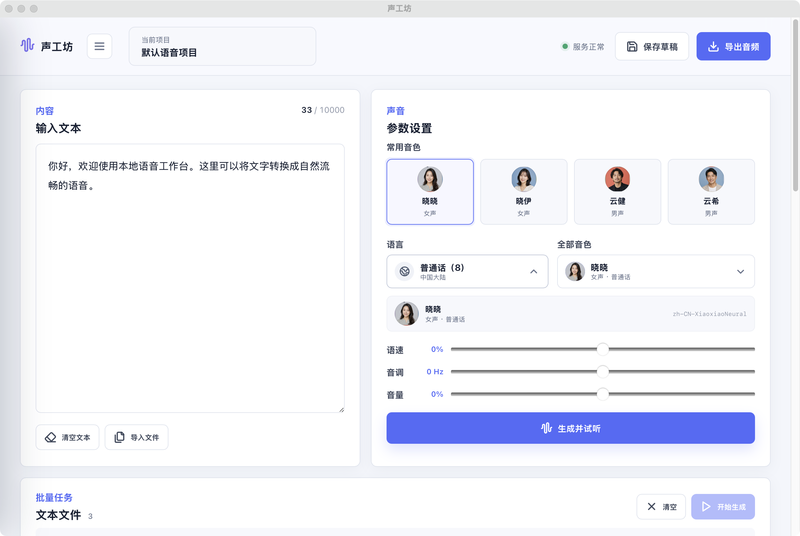

# 声工坊

声工坊是一款使用 Tauri 2 和 Rust 开发的轻量文字转语音工作台。应用直接连接在线语音服务，不需要 Python 环境，也不需要单独部署后端；界面、历史记录和导出的音频文件均由本地桌面应用管理。



## 主要功能

- 300+ 多语言音色，默认使用普通话晓晓音色
- 中文音色名称、头像、语言、性别、声音风格和推荐场景展示
- 自定义语速、音调和音量，输入语言与音色不匹配时主动提醒
- 生成后立即试听，使用真实音频频谱展示播放状态
- MP3 下载、桌面端默认导出文件夹和按时间自动命名
- 最近 50 条本地转换记录，可试听、复用、下载或删除
- 批量导入 Markdown 和纯文本文件，并发生成数量固定为 3
- 批量任务可随时停止；已完成结果保留，已取消任务可重新生成
- 音色目录支持按语言、性别和关键词筛选
- 界面缩放、高对比度、减少动态效果等无障碍设置
- 桌面端提供仅监听本机的 HTTP API
- 窄屏模式提供可打开、关闭的侧边菜单，适配不同窗口宽度

## 支持的系统版本

下表描述的是当前仓库实际配置和 GitHub Actions 产出的桌面安装包，不是 Tauri 框架的理论兼容范围。

| 平台 | 最低系统版本 | 处理器架构 | 安装包 | 当前状态 |
| --- | --- | --- | --- | --- |
| macOS | macOS 11 Big Sur | Apple Silicon、Intel | 通用 DMG | 正式支持 |
| Windows | Windows 10 1803 | x64 | NSIS EXE、MSI | 正式支持 |
| Windows | Windows 11 | x64 | NSIS EXE、MSI | 正式支持 |

补充说明：

- macOS 安装包使用 Universal Binary，同时包含 `arm64` 和 `x86_64`。
- Windows 当前只构建 x64 制品，暂未提供 Windows ARM64 安装包。
- Windows 7、Windows 8 和 Windows 8.1 不在当前支持范围内。
- Windows 需要 WebView2 Runtime。系统缺少运行环境时，安装程序会尝试联网获取，因此首次安装建议保持网络可用。
- 当前自动构建的 macOS 制品使用临时签名，尚未配置开发者证书和公证流程；正式分发前应补充签名与公证。
- iOS 和 Android 构建工作流仍处于开发验证阶段，不属于当前稳定桌面版本的支持范围。

## 下载与安装

### 从 GitHub 下载

1. 打开仓库的 [Releases](https://github.com/sxlisme/edge-tts-studio/releases) 页面。
2. macOS 下载 `.dmg`，Windows 日常安装优先下载 `.exe`。
3. 没有 Release 时，可以在 [Actions](https://github.com/sxlisme/edge-tts-studio/actions) 中打开最近一次成功的 `Desktop packages` 工作流，从 Artifacts 下载对应平台制品。

### macOS

1. 打开下载的 DMG。
2. 将“声工坊”拖入“应用程序”文件夹。
3. 从“应用程序”中启动声工坊。

macOS 11 及以上版本可运行。Apple Silicon 和 Intel Mac 使用同一个通用安装包。

### Windows

1. 普通用户建议运行 NSIS `.exe` 安装包。
2. 需要企业部署或统一安装时可以使用 `.msi`。
3. 安装完成后，从开始菜单启动“声工坊”。

当前 Windows 安装包仅支持 Windows 10 1803 及以上版本和 Windows 11 的 x64 系统。

## 使用方法

### 生成单条语音

1. 在“输入文本”区域输入需要转换的内容，单次最多 10,000 字。
2. 选择语言和音色。中文名称、性别和地区信息会显示在音色选项中。
3. 根据需要调整语速、音调和音量。
4. 点击“生成并试听”。生成期间会展示加载状态和耗时。
5. 生成完成后可以直接试听，或点击“下载 MP3”导出文件。

输入文本和音色语言应尽量一致。例如输入中文时优先选择普通话、粤语或中文（台湾）音色。语言不匹配可能导致发音不自然，部分组合也可能被在线服务拒绝。

### 批量生成文本文件

1. 点击输入区下方的“导入文件”。
2. 选择 `.md`、`.markdown`、`.txt` 或 `.text` 文件，每次最多导入 50 个文件。
3. 单个文件最大 2 MB，内容需要使用 UTF-8 编码。
4. 超过 10,000 字的文件会提示是否跳过，不会静默截断。
5. 点击“开始生成”，应用会以最多 3 个任务并发处理。

批量任务中的每条语音成功后会立即保存并显示在历史记录中，不需要等待整个批次结束。运行期间点击“停止生成”会取消当前请求并停止启动后续任务：已经完成的结果继续保留，取消的项目可以再次点击“开始生成”继续处理。

### 设置默认导出文件夹

桌面端可以在“高级设置”中选择默认导出文件夹。启用后，单条下载和批量生成结果会直接写入该目录，文件名默认使用生成时间，并自动避免覆盖同名文件。

如果文件夹被移动、删除或失去访问权限，应用会停止使用该路径并提示重新选择，不会改写到其他未知位置。

### 管理历史记录

- 应用最多保留最近 50 条转换记录。
- 点击历史文本可重新使用原文本和音色。
- 每条记录支持试听、下载和删除。
- 删除记录时，对应的本地音频文件也会一并删除。
- “清空记录”会删除全部历史和对应音频，操作前会再次确认。

### 浏览音色目录

从左侧菜单进入“音色展示”，可以查看全部音色及其语言、地区、性别、内容类型、声音风格和推荐使用场景。支持关键词搜索，以及按语言和性别筛选；点击“使用”即可返回工作台并切换到对应音色。

### 无障碍与显示设置

“高级设置”提供以下本地持久化选项：

- 整体界面缩放比例
- 高对比度模式
- 减少动态效果
- 默认导出文件夹
- 当前操作系统和应用版本信息

设置保存在本机，重新启动应用后仍会生效。

## 数据、联网与隐私

声工坊是本地优先应用，但语音合成需要连接在线语音服务。点击生成后，输入文本、音色和语音参数会发送给在线服务以返回音频；除此之外，项目没有接入统计、广告或用户账号服务。

转换历史和音频保存在本机应用数据目录：

- macOS：`~/Library/Application Support/com.sxlisme.voice-studio/`
- Windows：`%APPDATA%\com.sxlisme.voice-studio\`

目录中的 `history.json` 保存记录信息，`audio/` 保存对应 MP3。桌面 HTTP API 只监听 `127.0.0.1`，不会监听局域网或公网地址。

## 桌面 HTTP API

启动桌面应用后，本机 API 地址为 `http://127.0.0.1:8765`。API 与图形界面共享相同的音色、生成逻辑和历史数据。

### 健康检查

```bash
curl http://127.0.0.1:8765/api/health
```

### 获取音色

```bash
curl "http://127.0.0.1:8765/api/voices?locale=zh-CN"
```

### 生成 MP3

```bash
curl -X POST http://127.0.0.1:8765/api/synthesize \
  -H 'Content-Type: application/json' \
  -d '{
    "text": "你好，欢迎使用声工坊。",
    "voice": "zh-CN-XiaoxiaoNeural",
    "rate": "+0%",
    "volume": "+0%",
    "pitch": "+0Hz"
  }' \
  --output speech.mp3
```

生成成功后，响应头 `X-History-Id` 会包含对应的历史记录 ID。

### 历史接口

| 方法 | 地址 | 说明 |
| --- | --- | --- |
| `GET` | `/api/history` | 获取最近 50 条记录 |
| `GET` | `/api/history/{id}/audio` | 获取指定记录的 MP3 |
| `GET` | `/api/history/{id}/audio?download=1` | 以附件形式下载 MP3 |
| `DELETE` | `/api/history/{id}` | 删除记录和对应音频 |
| `DELETE` | `/api/history` | 清空全部记录和音频 |

端口 `8765` 被其他程序占用时，图形界面的 TTS 功能仍可使用，但本地 HTTP API 将无法启动。

## 本地开发

### 环境要求

- Node.js 20+
- Rust stable
- 当前平台对应的 Tauri 2 系统依赖
- macOS 构建需要 Xcode Command Line Tools
- Windows 构建需要 Visual Studio C++ Build Tools 和 WebView2 开发环境

### 启动开发模式

```bash
npm ci
npm run tauri -- dev
```

### 构建当前平台

```bash
npm run tauri -- build
```

### 运行检查

```bash
npm run build
cargo test --manifest-path src-tauri/Cargo.toml
cargo clippy --manifest-path src-tauri/Cargo.toml --all-targets -- -D warnings
```

## 自动构建与发布

仓库包含两个 GitHub Actions 工作流：

- `Desktop packages`：手动触发时生成 macOS 通用 DMG、Windows x64 NSIS EXE 和 MSI，并上传为 Actions Artifacts。
- `Mobile packages`：手动触发 Android APK/AAB 和未签名的 iOS 模拟器构建，用于开发验证。

推送名称符合 `v*` 的 Git 标签时，桌面工作流还会创建 GitHub Release，并把 DMG、EXE 和 MSI 附加到 Release。正式对外发布 macOS 或移动端制品前，需要在仓库中配置对应的开发者证书和签名密钥。

## 项目结构

```text
.
├── index.html                 # 应用页面结构
├── static/                    # 前端逻辑、样式和本地资源
├── src-tauri/                 # Rust 核心、Tauri 命令和本地 HTTP API
├── docs/                      # README 截图
└── .github/workflows/         # 桌面与移动端自动构建
```

## 常见问题

### 生成失败或接口返回 5xx

先确认设备可以访问在线语音服务，再检查输入内容是否为空、是否超过 10,000 字，以及文本语言与所选音色是否一致。错误提示旁的详情图标可以查看底层返回信息。

### Windows 启动后没有界面

确认系统版本满足 Windows 10 1803 及以上，并安装或修复 WebView2 Runtime，然后重新启动应用。

### 批量任务停止后为什么历史中还有部分记录

停止操作不会删除已经成功的结果。点击停止前已经完成的项目会继续保留在历史记录中，尚未完成或未开始的项目会标记为已取消，可稍后继续生成。

### 默认导出目录失效

目录不存在、不是文件夹或无法写入时，应用会清除失效设置。请在“高级设置”中重新选择一个存在且有写入权限的文件夹。

## 开发者

- 开发者：sxlisme
- 邮箱：blackberrysxl@163.com
